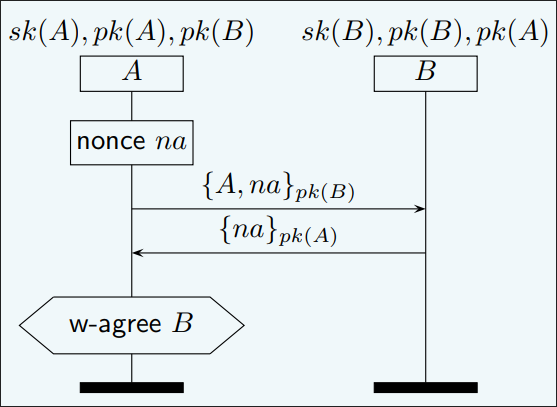
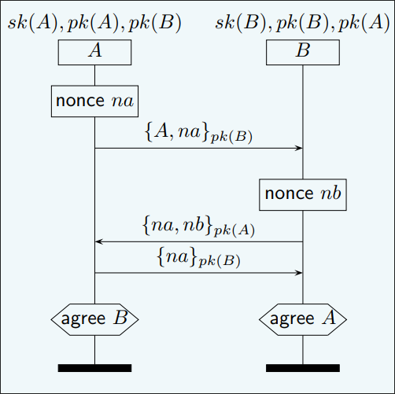
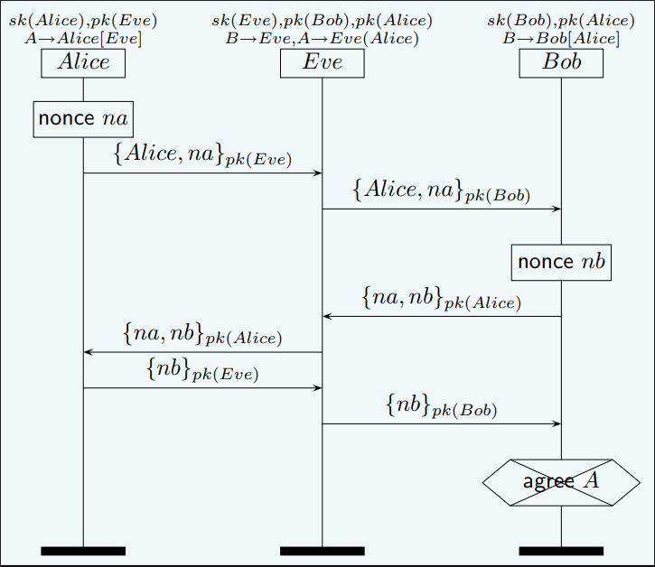

## 1. 关于Injective Agreement(单射一致性),Weak Agreement(弱一致性)和Non-Injective Agreement(非单射一致性)
对于一个协议，我们定义通讯双方为Alice和Bob,这三种一致性都有一个统一的前提，即 **Alice和Bob成功完成了一轮通讯，同时Alice作为通讯的发起者，ta单方面的认为ta在和Bob进行通讯,同时存在一个变量集𝟇,其中所有元素均为Alice和Bob通讯时使用的变量 **。有了该前提后，对于三种一致性分别满足如下的条件：

- **Weak Agreement**:Bob 在通信过程中始终认为ta在与Alice通信。
- **Non-Injective Agreement**: Bob 在通信过程中始终认为ta在与Alice通信。同时Alice和Bob对于通信交换的变量集𝟇中的内容都认可，也就是对Alice和Bob来说,𝟇完全相同。
- **Injective Agreement**: 在Non-Injective Agreement的基础上,Alice的每一次对话都对应着Bob的唯一一次对话。也就是这个属性,被称之为单射一致性,就像集合中的单射性质一样,是一一对应的关系。

> Non-Injective Agreement的实例: 中间人攻击,第一次通信Alice被欺骗,第一次通信完毕后中间人获得了Bob的私钥,此后Alice每次发起与Bob的通信请求,实际上都是在与中间人通信,这样对于Alice的每一次对话,Bob都不一定能找出唯一一次对话与之对应,这样一来就不符合单射一致性的条件,称这个协议是非单射一致性的。





## 2. 用spin验证Needham-Schroeder Protocol的单射一致性
- 首先编写Alice的进程,关于Alice的行为有如下几点:
    - Alice首先向Bob(实际上是Eve)发送一个nonce,并且Alice认为ta在与Bob通信。并将信息送入发送消息缓冲区。
    - Alice接受到Bob(实际上是Eve)发送回的nonce,并且Alice认为ta在与Bob通信。
    - Alice发送回Bob(实际上是Eve)的nonce,并且Alice认为ta在与Bob通信。
- Eve中间人操作：
    - Eve接受到Alice发送的A的nonce,先用自己的私钥解密并且Eve将消息用Bob的公钥加密后转发给Bob。
    - Eve接受到Bob发送的B的nonce,先用自己的私钥解密并且Eve将消息用Alice的公钥加密后转发给Alice。
    - Eve接受到Alice发送的B的nonce,先用自己的私钥解密并且Eve将消息用Bob的公钥加密后转发给Bob。
- Bob操作：
    - Bob接受到Alice发送的A(实际上是Eve)的nonce,先用自己的私钥解密并且Bob将消息用Alice(Eve)的公钥加密后转发给Alice。并将消息送入接收消息缓冲区。
    - Bob生成一个nonce发送回Alice(Eve)，并将消息送入发送消息缓冲区。
    - Bob接受到Alice(Eve)发送的B的nonce。并将消息送入接收消息缓冲区。
- `ltl`表达式: `[] (AliceSuccess && BobSuccess) -> (<> AliceAgree&&BobAgree);`

### 完整代码如下：
```c
// Needham-Schroeder 协议的单射一致性(injective-agreement)的验证
#define HASH(x) (x % 255)
// 接收消息并将消息放入接收缓冲区
inline EnqueueRcvBuffer(msg) {
    receiveBuffer[HASH(msg.num)].num = msg.num; 
    receiveBuffer[HASH(msg.num)].sender = msg.sender; 
    receiveBuffer[HASH(msg.num)].receiver = msg.receiver; 
    receiveBuffer[HASH(msg.num)].msg1 = msg.msg1; 
    receiveBuffer[HASH(msg.num)].msg2 = msg.msg2; 
    receiveBuffer[HASH(msg.num)].key = msg.key; 
    printf("Enqueue Message:%d to receiveBuffer\n",HASH(msg.num));
}

inline EnqueueSendBuffer(msg) {
    sendBuffer[HASH(msg.num)].num = msg.num; 
    sendBuffer[HASH(msg.num)].sender = msg.sender; 
    sendBuffer[HASH(msg.num)].receiver = msg.receiver; 
    sendBuffer[HASH(msg.num)].msg1 = msg.msg1; 
    sendBuffer[HASH(msg.num)].msg2 = msg.msg2; 
    sendBuffer[HASH(msg.num)].key = msg.key; 
    printf("Enqueue Message:%d to sendBuffer\n",HASH(msg.num));
}

inline EQUAL(x,y) {
    x.num == y.num && x.sender == y.sender && x.receiver == y.receiver && x.msg1 == y.msg1 && x.msg2 == y.msg2 && x.key == y.key;
}

inline COPY(from,to) {
    to.num = from.num; 
    to.sender = from.sender; 
    to.receiver = from.receiver; 
    to.msg1 = from.msg1; 
    to.msg2 = from.msg2; 
    to.key = from.key;
}

// 通信者的身份
mtype:ID = {IDA,IDB,IDS};
// 公钥列表
mtype:KEY = {KPA,KPB,KPS};
// 消息类型，表示消息类型
mtype:DATA = {NA,NB,ANY};
// 验证消息，表示消息验证者的身份
mtype:VERIFY = {VA,VB,VS};

byte Num = 0;
bool AliceAgree = false;
bool BobAgree = false;
bool AliceSuccess = false;
bool BobSuccess = false;
typedef Message{
    byte num;
    mtype:ID sender,receiver;
    mtype:DATA msg1,msg2;
    mtype:KEY key;
}

// 用于交换消息的信道
chan ch = [0] of {mtype:ID, mtype:VERIFY,Message};


Message sendBuffer[255];
Message receiveBuffer[255];

proctype Alice () {
    mtype:ID sender,receiver;
    mtype:VERIFY verifier;
    mtype:KEY key;
    mtype:DATA nonce;
    Message outmsg,inmsg; // 发送的消息和接收的消息
    // A认为在与B通信,但是是与伪装成B的Eve通信
    // 所以receiver = IDS
    atomic {
        receiver = IDS;
        key = KPS;
        verifier = VB;
    }
    // A向伪装成B的Eve发送消息，表示请求连接。
    atomic {
        outmsg.num = Num;
        outmsg.sender = IDA;
        outmsg.msg1 = NA;
        outmsg.msg2 = ANY;          
        outmsg.receiver = receiver;
        outmsg.key = key;
        ch ! receiver,VA,outmsg;
        EnqueueSendBuffer(outmsg);
    }
    // A接收到Eve发来的消息，里面包含的是B的nonce
    atomic {
        ch ? IDA,VB,inmsg;
    }
    
    atomic {
        if 
        :: inmsg.msg1 != NA -> 
            printf("Wrong Message\n");
        :: else -> nonce = inmsg.msg2;
        fi;
    }
    // A向Eve发送消息，里面包含了B的nonce
    atomic {
        Num = Num + 1; 
        outmsg.num = Num;
        outmsg.sender = IDA;
        outmsg.receiver = receiver;
        outmsg.msg1 = nonce;
        outmsg.msg2 = ANY;
        outmsg.key = key;
        ch ! receiver,VA,outmsg;
        EnqueueSendBuffer(outmsg);
    }
    AliceSuccess = true;
    // 遍历数组判断Alice和Bob对变量集的内容是否达成一致
    byte cnt = 0;
    do
        ::atomic {
            for (cnt : 1 .. Num - 1){
                if 
                    :: EQUAL(sendBuffer[cnt],receiveBuffer[cnt]) -> 
                        goto err;
                    :: else -> skip;
                fi;                                            
            }                              
        }
    od;
err:
    printf("Alice not agree with Bob\n");
end:

}

proctype Bob () {
    Message outmsg,inmsg;
    mtype:ID receiver;
    mtype:VERIFY verifier;
    mtype:KEY key;
    // B接收到Eve发来的消息，里面包含的是A的nonce
    atomic {
        ch ? IDB,verifier,inmsg;
    }
    atomic {
        if 
        :: inmsg.key != KPB -> 
            printf("Wrong Public Key\n");
        :: else -> skip;
        fi;
        EnqueueRcvBuffer(inmsg);
    }
    
    atomic {
        if 
        // B认为在与A通信
        :: verifier == VA -> 
            printf("Bob receive A's Message\n");
            key = KPA;
        :: else -> skip;
        fi;
        // 接收到的消息放入接收缓冲区
        EnqueueRcvBuffer(inmsg);
        outmsg.num = inmsg.num;
        outmsg.sender = IDB;
        outmsg.receiver = IDS;
        outmsg.msg1 = inmsg.msg1;
        outmsg.msg2 = NB;
        outmsg.key = key;
        ch ! IDS,VB,outmsg;
    }
    // B接受到Eve发来的消息，里面包含了B的nonce 
    atomic {
        ch ? IDB,verifier,inmsg;
        // 如果消息体包含了B的nonce，则表示A和B通信成功
        if 
        :: inmsg.msg1 == NB -> BobSuccess = true;
        :: else -> goto err;
        fi;
        EnqueueRcvBuffer(inmsg);
        goto end;
    }
    // 遍历数组判断Alice和Bob对变量集的内容是否达成一致
    byte cnt = 0
    do
        :: true -> 
            if 
                :: EQUAL(receiveBuffer[cnt],sendBuffer[cnt]) -> 
                    cnt = cnt + 1;
                    if 
                        :: cnt == Num -> 
                            BobAgree = true;
                            goto end;
                        :: else -> break;
                    fi;
                :: else -> goto err;
            fi;
    od;   
err:
    printf("Bob receive wrong message\n");
end:

}

proctype Eve () {
    Message outmsg,inmsg;
    mtype:VERIFY verifier;
    atomic {
        // Eve接收A的消息，然后将消息转发给B
        ch ? IDS,verifier,inmsg;
        COPY(inmsg,outmsg);
        outmsg.receiver = IDB;
        outmsg.key = KPB;
    }
    atomic {
        ch ! IDB,verifier,outmsg;
    }
    // Eve接收B的消息，然后将消息转发给A,其中包含了B的nonce
    atomic {
        ch ? IDS,verifier,inmsg;
        COPY(inmsg,outmsg);
    }
    atomic {
        ch ! IDA,verifier,outmsg;
    }
    // Eve转发A的消息给B，其中包含了B的nonce
    atomic {
        ch ? IDS,verifier,inmsg;
        COPY(inmsg,outmsg);
        outmsg.key = KPB;
        outmsg.receiver = IDB;
    }
    
    atomic {
        ch ! IDB,verifier,outmsg;
    }
    
}


ltl agreement {
    [] (AliceSuccess && BobSuccess) ->  (<> AliceAgree&&BobAgree);
}

init {
    run Alice();
    run Bob();
    run Eve();
}
```

## 3.验证结果
对源文件`injective-agreement.pml`使用cspin脚本进行编译，得到如下结果:
```sh
# cspin injective-agreement.pml
(Spin Version 6.5.2 -- 6 December 2019)
	+ Partial Order Reduction

Bit statespace search for:
	never claim         	- (not selected)
	assertion violations	+
	cycle checks       	- (disabled by -DSAFETY)
	invalid end states	- (disabled by -E flag)

State-vector 3160 byte, depth reached 44, errors: 0
       37 states, stored
        8 states, matched
       45 transitions (= stored+matched)
       35 atomic steps

hash factor: 3.62751e+06 (best if > 100.)

bits set per state: 3 (-k3)

Stats on memory usage (in Megabytes):
    0.112	equivalent memory usage for states (stored*(State-vector + overhead))
   16.000	memory used for hash array (-w27)
    0.305	memory used for bit stack
    2.136	memory used for DFS stack (-m40000)
   18.918	total actual memory usage


pan: elapsed time 0 seconds
```
可知，验证成功。