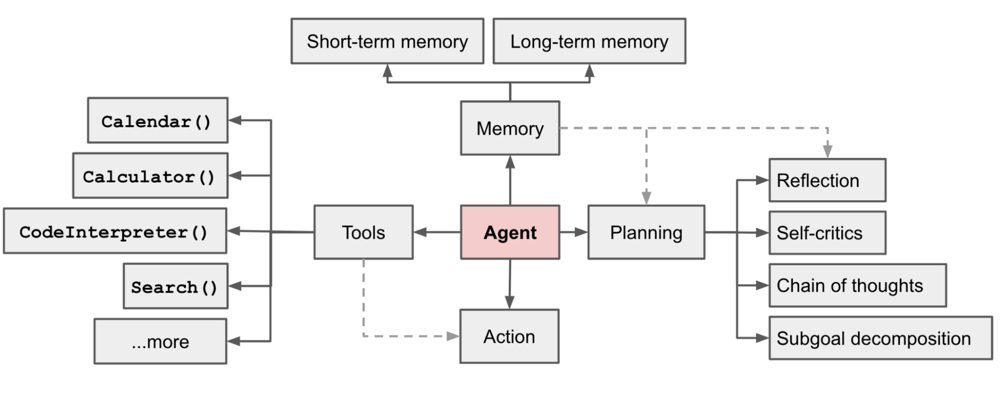
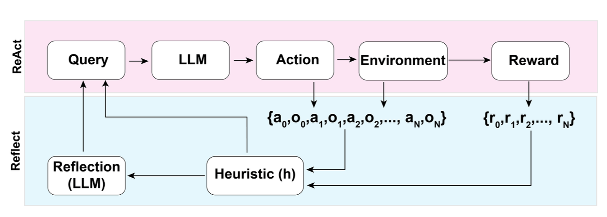
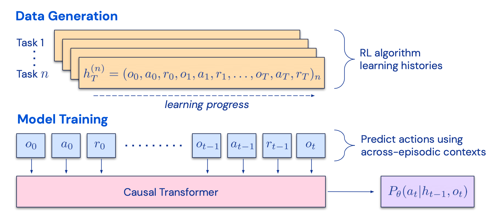

## Overview
本文介绍了由大语言模型驱动的自动代理的原理，在大预言模型越来越流行和日渐强大的今天，使用大预言模型不仅可以进行文书，编码上的一些辅助，更可以成为一个通用的自主问题解决器，比如作为自动代理的驱动。

本文主要从代理系统（ Agent System ）的组成角度进行介绍，一个代理系统由3个部件组成：

- 规划器（ Planning ）
- 记忆（ Memory ）
- 工具调用 （ Tool Use ）



同时，本文还举出了三个LLM Powered Agent 实例：

- Secientific Discovery Agent：一个拥有多个外部专业工具的科学开发辅助工具，主要用于辅助化学药物的研发和合成。
- Generative Agent Simulation：一个用LLM驱动的虚拟任务模拟实验，其中有25个虚拟人物都由代理控制，用于模拟人类行为。
- Proof-of-Concept Exanples：使用AutoGPT对一些概念的验证的演示事例。

 

文章最后还提出了构建LLM-Powered-Agent存在的一些限制和挑战：

- 有限上下文长度：上下文长度的限制会限制对历史信息的总结，细节上的操作，API调用的上下文等方面。
- 长期计划和任务分解的挑战：对于意料之外的错误的处理和学习使得Agent无法有效的进行长期规划和求解。
- 自然语言接口的可靠性：大部分agent的输出都不一定可靠，因为LLM可能会处理错误，有时候甚至会变得“叛逆”。

## 组件一：规划器

> A complicated task usually involves many steps. An agent needs to know what they are and plan ahead.
> 

对于规划器的执行过程主要分两个部分：**任务分解（Task Decomposition）**和 **自我反省（Self-Reflection）**。

对于**任务分解**文中提到了两个概念：思维链（Chain of Thought，CoT）和思维树（Tree of Thought）。思维链是由 [Wei et al. 2022](https://arxiv.org/abs/2201.11903) 提出的，已经成为一个增强模型在复杂任务上的标准技术。模型被引导“一步步思考”来利用更多测试时间将复杂任务分解成小而简单的步骤。而思维树[Yao et al. 2023](https://arxiv.org/abs/2305.10601)，是对于CoT的扩展。其原理是在CoT将复杂问题分解成每个step后，对每个step再生成多个想法，从而形成一个树状结构。对树结构的搜索方法基于给定的prompt或多数票（majority vote）决定为BFS或是DFS。

其中还提到了一种方法：LLM+P [Liu et al. 2023](https://arxiv.org/abs/2304.11477) 。主要是使用了一个外部经典规划器来进行长期规划。这种方法使用 PDDL （Planning Domain Definition Language）作为中间接口进行规划问题的描述，主要步骤如下所示：

1. LLM将问题转化为 [“Problem PDDL”](https://planning.wiki/ref/pddl/problem)
2. 然后请求外部的经典规划器基于一个已存在的[“Domain PDDL"](https://planning.wiki/ref/pddl/domain)生成一个PDDL规划。
3. 将 2 中生成的 PDDL 规划翻译成自然语言

这个方法的核心在于将规划的任务交给外部的规划器，而不是LLM进行规划，这就要求步骤中的Domain PDDL和外部使用的规划器是适合且准确的。

**自我反省**对于人类是一个重要的方面，对于不如人类（目前来说）的机器，更是如此。对于自动代理来说，它通过完善过去做的决定以及改进之前的错误来迭代进化。

[ReAct](https://arxiv.org/abs/2210.03629) 通过将动作空间扩展为特定任务离散动作和语言空间组合，将推理和动作整合在LLM中。前者

让 LLM 拥有与环境交互的能力，例如使用 Wikipedia 的搜索 API；而后者则提示 LLM 生成自然语言的推理追踪。

ReAct 提示模板给 LLM 的思考整合了明确的步骤，大致如下：

```jsx
Thought: ...
Action: ...
Observation: ...
... (Repeated many times)
```

<aside>
💡 ReAct 方法是在 Act 方法的基础上进行了改进，加入了Thought这一栏，实验证明，ReAct 方法的表现要优于 Act 方法

</aside>

[Reflxion](https://arxiv.org/abs/2303.11366) 是一个通过给代理配备动态记忆和自我反省能力从而提高模型推理能力的框架，Reflxion 有一个标准强化学习设置，其中动作空间的设置和 ReAct 一样，具体原理如图所示。



在每一个动作$a_i$之后，代理都会计算其启发值$h_i$并根据结果选择性的重置环境开始一个新的试验。对于这个启发式函数$h$，其作用是发现模型中的效率低下和虚构问题并及时停止。

自我反思的具体创建是通过二元组实现的，每个二元组都是一个失败的轨迹和理想的反思构成，具体来说失败的轨迹就是尝试过的但失败的执行序列，理想的反思就是将来要执行的可能成功的执行序列。这些二元组被添加到代理的记忆中，作为上下文使用。

回顾链（ [Chian of Hindsight](https://arxiv.org/abs/2302.02676) ，CoH ）鼓励模型通过展现过去的一系列输出来改进现有输出，并且每个都具有反馈信息。人类的反馈信息使用一个集合$D_h=\{(x,y_i,r_i,z_i)\}_{i=1}^{n}$来表示，其中$x$表示一个prompt，每一个$y_i$都是模型提供的补全，$r_i$是人对$y_i$的评分，$z_i$则是相应的人类对回顾的反馈。假设集合中的$z_i$是从大到小排列的，则这个过程变成了一个有监督的微调过程，输入序列的形式为

$\tau_h=(x,z_i,y_i,z_j,y_j,...z_n,y_n)$，其中i ≤ j ≤ n。在模型预测$y_j$的时候，会根据$j$之前的序列进行输出优化和改进。

CoH 在训练过程中添加了正则化来控制模型过拟合问题，并且通过随机屏蔽过去的标记，预防捷径和复制行为的出现。

[Algorithm Distillation](https://arxiv.org/abs/2210.14215) 将该思想应用于强化学习的跨事件学习中，跨任务的执行序列这里我称之为$H$算法被封装在一个长期记忆政策里，这个方法的核心在于在每次代理和环境交互并且更加准确后，将学习历史喂入模型进行训练，目标和CoH不同的点在于训练模型而不是针对某个任务的训练。

这个方法假设对于任何可以生成学习历史集合的算法，都可以通过对过去动作行为进行行为克隆将其“蒸馏”成一个神经网络。在每次训练中，该方法选择一个随机的任务和一个子序列$h\subseteq H$作为数据进行训练，这样一来训练过程便与任务本身无关。



实际上，模型的上下文长度是很短的，所以需要每个任务的序列足够短才能构建起一个多任务序列，而每个多任务至少需要2-4个任务才能达到几乎完美的上下文中的强化学习算法。

在与ED（expert distillation），源策略，RL^2的比较中，AD的表现接近于RL^2，但训练速度远快于RL^2，此外，当使用源策略的部分训练历史作为条件时，AD的改进速度也比ED基准算法快得多。

### Reference
Weng, Lilian. (Jun 2023). LLM-powered Autonomous Agents”. Lil’Log. https://lilianweng.github.io/posts/2023-06-23-agent/.