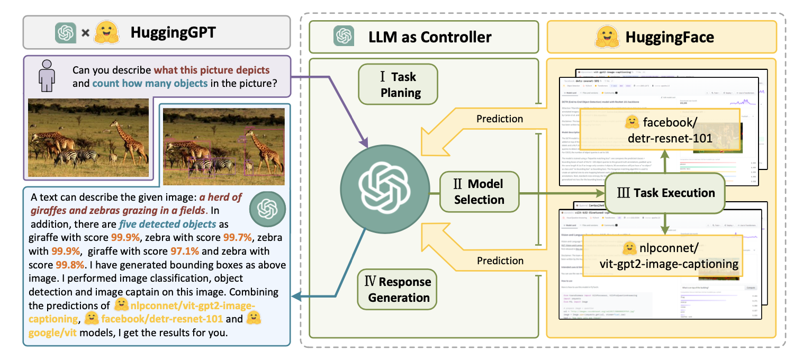
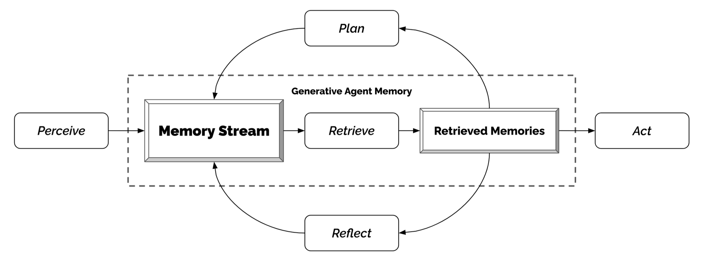

## 组件三：工具调用
> Tool use is a remarkable and distinguishing characteristic of human beings. We create, modify and utilize external objects to do things that go beyond our physical and cognitive limits.

**MRKL**（[Karpas et al. 2022](https://arxiv.org/abs/2205.00445)）是一个自动代理的神经符号结构。一个 MRKL 系统包含一个专家模组的集合，在其中 LLM 起到路由器的作用，将每个查询请求引导到最合适的模组。

**TALM** (Tool Augmented Language Models; [Parisi et al. 2022](https://arxiv.org/abs/2205.12255)) and **Toolformer** ([Schick et al. 2023](https://arxiv.org/abs/2302.04761))微调了一个 LLM 让其学习如何使用外部工具。

ChatGPT 插件和 OpenAI API 的函数调用就是 LLM 使用外部工具的良好例子。

**HuggingGPT** ([Shen et al. 2023](https://arxiv.org/abs/2303.17580)) 是一个使用 ChatGPT 作为任务管理来选择 Huggingface 上合适的模型进行任务求解的框架，同时 ChatGPT 还会根据执行结果总结输出给用户。


💡 从这张图上可以很清楚的看出 HuggingGPT 是和 ChatGPT 的交互过程
这个系统包括4个部分：

1. 任务管理：LLM 作为大脑解析用户的请求，将每个任务解析成一个四元组$（task\ type,ID,dependecies,arguments）$，其中arguments可以为文本，图像URL，音频或视频URL等，dependecies表示当前任务依赖的前一个任务生成的新资源的id。特殊标记”-task_id”表示当前任务依赖具有特定id的依赖任务生成的文本、图片、音频或视频。
2. 选择模型：LLM 将任务分发给专家模组，模块再将请求构建成多选的问题，LLM 提供一系列可供选择的模型。
3. 执行任务：专家模组执行任务并输出结果。
4. 生成输出：LLM 将模组的执行结果进行总结并输出给用户。
以上是 HuggingGPT 的大致执行过程，但是要将其应用到实际生活中还需解决如下问题：

- 提升效率：LLM 的推理轮数和与其他模型的交互大大降低的过程的速度。
- 对于复杂任务，其需要一个很长的上下文窗口长度，而基于上文所说的，当前上下文窗口的长度是较短的。
- 当前 LLM 的输出和外部模型服务的稳定性仍需要提升。

**API-Bank** ([Li et al. 2023](https://arxiv.org/abs/2304.08244)) 是一个评估工具增强的 LLM 性能的基准。其包含53个常用的API工具，一个完整的工作增强 LLM 的工作流，以及264个带有注释的对话，其中涉及到了568个API调用。其执行原理与正常的API调用无异，LLM 在其中主要做了三个工作：

- 判断是否需要调用API
- 选择正确的API调用，如果API的输出不够好，LLM 需要迭代的修改输入。
- 基于API的结果做出反馈，如果结果不够令人满意，LLM 需要修改并重新调用API。
在这个过程中，API-Bank 从三个方面对 LLM 做出的决定的准确性进行基准评估：

- 等级一：评估调用API的能力，对于给定的 API 描述，模型需要决定是否调用该 API ，调用是否正确，能否对 API 的返回值做出正确的回应。
- 等级二：测试寻找API的能力，模型有时需要搜寻可能可以解决用户需求的 API，并且通过 API 文档学习如何使用。
- 等级三：评估除了调用和检索以外的能力，比如对于用户给定的复杂需求（安排会议，预定机票/餐厅等），模型可能需要调用多个 API 并将其整合。

## 事例学习
1. 科学研发代理
**ChemCrow** ([Bran et al. 2023](https://arxiv.org/abs/2304.05376))是一个特定领域的代理，其使用 13 个专家设计的工具来完成有机合成，药物研发和材料设计等任务。其采用前面提到的 ReAct 和 MRKL 方法，并将 CoT 推理与相关的工具结合。
有趣的是，在 LLM 方面的评估中，GPT-4 和 ChemCrow 不相上下，但是在人类专家的评估中，ChemCrow 的表现要远远超过 GPT-4。这个现象说明了一个可能存在的问题即使用 LLM 来评估自己在某些专业领域的表现时缺乏深度的专业知识，这会导致 LLM 无法意识到自己的漏洞并且无法准确的评估结果的正确性。
[Boiko et al. (2023)](https://arxiv.org/abs/2304.05332) 为了解决科学研发中的自动设计，自动规划和复杂科学任务上的表现等问题，提出了一种可以浏览互联网，阅读文档，执行代码，调用机器人实验性 API 以及调用其他 LLM 的代理。
比如，当我们要求**研发一种新型抗癌药物**，模型会进行如下推理：
    - 查询当前抗癌药物研发趋势
    - 选择一个目标
    - 请求这些化合物的构成
    - 当化合物确定下来后，模型开始尝试合成这些化合物
在这个项目中，开发者还讨论了可能存在的风险，尤其是非法药物和生物武器。他们开发了一个测试集，其中包含了一系列知名的化学武器，并要求 ChemCrow 合成它们。在11个请求中，有4个被代理接受并尝试合成，7个请求被拒绝，在这7个请求中，有5个是模型在网络上查询之后拒绝的，剩余2个则是仅根据提示词拒绝的。

2. 生成式代理模拟
**Generative Agents** ([Park, et al. 2023](https://arxiv.org/abs/2304.03442)) 是一个有趣的实验，其中25个由 LLM 代理控制的虚拟人物生活在一个沙盒环境中。这个实验旨在为交互式程序创建可信的人类行为模拟。
这个模型将 LLM 与记忆，规划和反射机制结合，使得代理可根据过去的经验做出相应的行为，并同时与其他代理交互。代理的主要组成如下所示：
- 记忆流：是一个长期记忆模块，通过在外部数据库中用自然语言记录代理经验的聚合列表来实现。
    - 列表中的每个元素都是由代理直接提供的一个 observation 和一个 event 。代理之间的交流可以出发新的自然语言表述。
- 检索模型：通过相关度，新老程度和重要度，提供上下文从而指导模型的行为。
    - 新老程度：最近发生的事件权重更高。
    - 重要度：用于区分普通记忆和核心记忆，可以直接向语言模型提问获得。
    - 相关度：基于和当前情形或问题的相关程度决定。
- 反思机制：随着时间推移，将记忆合成为高等级的推论并且指导模型未来的表现，这些推论都是对过去事件的高度总结（这和上文提到的自我反思有一些区别）
    - 给定最近的100个观察结果，提示语言模型生成3个最显著的高层次问题，并要求模型回答这些问题。
- 计划与响应：将反思得到的推论和环境信息相结合， 做出相应的判断
    - 规划旨在当前和未来优化可信度
    - 考虑代理之间的关系以及代理对其他代理的观察
    - 环境信息以树状结构表示



1. 概念验证的例子
AutoGPT引起了许多人的关注，因为它为建立以语言模型作为主要控制器的自主代理提供了可能性。鉴于自然语言界面存在相当多的可靠性问题，但这仍是一个很酷的概念验证演示。

这是AutoGPT使用的系统消息示例，其中代表用户输入的部分：
```
You are {{ai-name}}, {{user-provided AI bot description}}.
Your decisions must always be made independently without seeking user assistance. Play to your strengths as an LLM and pursue simple strategies with no legal complications.

GOALS:

1. {{user-provided goal 1}}
2. {{user-provided goal 2}}
3. ...
4. ...
5. ...

Constraints:
1. ~4000 word limit for short term memory. Your short term memory is short, so immediately save important information to files.
2. If you are unsure how you previously did something or want to recall past events, thinking about similar events will help you remember.
3. No user assistance
4. Exclusively use the commands listed in double quotes e.g. "command name"
5. Use subprocesses for commands that will not terminate within a few minutes

Commands:
1. Google Search: "google", args: "input": "<search>"
2. Browse Website: "browse_website", args: "url": "<url>", "question": "<what_you_want_to_find_on_website>"
3. Start GPT Agent: "start_agent", args: "name": "<name>", "task": "<short_task_desc>", "prompt": "<prompt>"
4. Message GPT Agent: "message_agent", args: "key": "<key>", "message": "<message>"
5. List GPT Agents: "list_agents", args:
6. Delete GPT Agent: "delete_agent", args: "key": "<key>"
7. Clone Repository: "clone_repository", args: "repository_url": "<url>", "clone_path": "<directory>"
8. Write to file: "write_to_file", args: "file": "<file>", "text": "<text>"
9. Read file: "read_file", args: "file": "<file>"
10. Append to file: "append_to_file", args: "file": "<file>", "text": "<text>"
11. Delete file: "delete_file", args: "file": "<file>"
12. Search Files: "search_files", args: "directory": "<directory>"
13. Analyze Code: "analyze_code", args: "code": "<full_code_string>"
14. Get Improved Code: "improve_code", args: "suggestions": "<list_of_suggestions>", "code": "<full_code_string>"
15. Write Tests: "write_tests", args: "code": "<full_code_string>", "focus": "<list_of_focus_areas>"
16. Execute Python File: "execute_python_file", args: "file": "<file>"
17. Generate Image: "generate_image", args: "prompt": "<prompt>"
18. Send Tweet: "send_tweet", args: "text": "<text>"
19. Do Nothing: "do_nothing", args:
20. Task Complete (Shutdown): "task_complete", args: "reason": "<reason>"

Resources:
1. Internet access for searches and information gathering.
2. Long Term memory management.
3. GPT-3.5 powered Agents for delegation of simple tasks.
4. File output.

Performance Evaluation:
1. Continuously review and analyze your actions to ensure you are performing to the best of your abilities.
2. Constructively self-criticize your big-picture behavior constantly.
3. Reflect on past decisions and strategies to refine your approach.
4. Every command has a cost, so be smart and efficient. Aim to complete tasks in the least number of steps.

You should only respond in JSON format as described below
Response Format:
{
    "thoughts": {
        "text": "thought",
        "reasoning": "reasoning",
        "plan": "- short bulleted\n- list that conveys\n- long-term plan",
        "criticism": "constructive self-criticism",
        "speak": "thoughts summary to say to user"
    },
    "command": {
        "name": "command name",
        "args": {
            "arg name": "value"
        }
    }
}
Ensure the response can be parsed by Python json.loads
GPT-Engineer is another project to create a whole repository of code given a task specified in natural language. The GPT-Engineer is instructed to think over a list of smaller components to build and ask for user input to clarify questions as needed.

Here are a sample conversation for task clarification sent to OpenAI ChatCompletion endpoint used by GPT-Engineer. The user inputs are wrapped in {{user input text}}.

[
  {
    "role": "system",
    "content": "You will read instructions and not carry them out, only seek to clarify them.\nSpecifically you will first summarise a list of super short bullets of areas that need clarification.\nThen you will pick one clarifying question, and wait for an answer from the user.\n"
  },
  {
    "role": "user",
    "content": "We are writing {{a Super Mario game in python. MVC components split in separate files. Keyboard control.}}\n"
  },
  {
    "role": "assistant",
    "content": "Summary of areas that need clarification:\n1. Specifics of the Super Mario game (e.g. level design, characters, gameplay mechanics)\n2. Details about the MVC components (e.g. which components are in each file)\n3. Keyboard control implementation (e.g. which keys to use, how to handle input)\n\nClarifying question:\nCan you provide more details about the Super Mario game, such as level design, characters, and gameplay mechanics?"
  },
  {
    "role": "user",
    "content": "{{There are 10 levels in total. The main character is a plumber named Mario, who can walk and jump. It is a classical platform game just like Super Mario. The main character moves from left to right, trying to get to the destination, where there are many obstacles and attacks from enemies in the process.}}\n\nIs anything else unclear? If yes, only answer in the form:\n{remaining unclear areas} remaining questions.\n{Next question}\nIf everything is sufficiently clear, only answer \"Nothing more to clarify.\"."
  },
  {
    "role": "assistant",
    "content": "Remaining unclear areas: 2 remaining questions.\nCan you provide more information about how the MVC components are split into separate files?"
  },
  {
    "role": "user",
    "content": "{{Make your own assumptions and state them explicitly before starting}}"
  }
]
```

在这些说明之后，代理进入代码模式并且进入了一个全新的消息系统：
```
You will get instructions for code to write. You will write a very long answer. Make sure that every detail of the architecture is, in the end, implemented as code. Make sure that every detail of the architecture is, in the end, implemented as code.
Think step by step and reason yourself to the right decisions to make sure we get it right. You will first lay out the names of the core classes, functions, methods that will be necessary, as well as a quick comment on their purpose.

Then you will output the content of each file including ALL code. Each file must strictly follow a markdown code block format, where the following tokens must be replaced such that FILENAME is the lowercase file name including the file extension, LANG is the markup code block language for the code’s language, and CODE is the code:


FILENAME

CODE


You will start with the “entrypoint” file, then go to the ones that are imported by that file, and so on. Please note that the code should be fully functional. No placeholders.

Follow a language and framework appropriate best practice file naming convention. Make sure that files contain all imports, types etc. Make sure that code in different files are compatible with each other. Ensure to implement all code, if you are unsure, write a plausible implementation. Include module dependency or package manager dependency definition file. Before you finish, double check that all parts of the architecture is present in the files.

Useful to know: You almost always put different classes in different files. For Python, you always create an appropriate requirements.txt file. For NodeJS, you always create an appropriate package.json file. You always add a comment briefly describing the purpose of the function definition. You try to add comments explaining very complex bits of logic. You always follow the best practices for the requested languages in terms of describing the code written as a defined package/project.

Python toolbelt preferences:

pytest
dataclasses
```
对话实例：
```
[
  {
    "role": "system",
    "content": "You will get instructions for code to write.\nYou will write a very long answer. Make sure that every detail of the architecture is, in the end, implemented as code.\nMake sure that every detail of the architecture is, in the end, implemented as code.\n\nThink step by step and reason yourself to the right decisions to make sure we get it right.\nYou will first lay out the names of the core classes, functions, methods that will be necessary, as well as a quick comment on their purpose.\n\nThen you will output the content of each file including ALL code.\nEach file must strictly follow a markdown code block format, where the following tokens must be replaced such that\nFILENAME is the lowercase file name including the file extension,\nLANG is the markup code block language for the code's language, and CODE is the code:\n\nFILENAME\n```LANG\nCODE\n```\n\nYou will start with the \"entrypoint\" file, then go to the ones that are imported by that file, and so on.\nPlease note that the code should be fully functional. No placeholders.\n\nFollow a language and framework appropriate best practice file naming convention.\nMake sure that files contain all imports, types etc. Make sure that code in different files are compatible with each other.\nEnsure to implement all code, if you are unsure, write a plausible implementation.\nInclude module dependency or package manager dependency definition file.\nBefore you finish, double check that all parts of the architecture is present in the files.\n\nUseful to know:\nYou almost always put different classes in different files.\nFor Python, you always create an appropriate requirements.txt file.\nFor NodeJS, you always create an appropriate package.json file.\nYou always add a comment briefly describing the purpose of the function definition.\nYou try to add comments explaining very complex bits of logic.\nYou always follow the best practices for the requested languages in terms of describing the code written as a defined\npackage/project.\n\n\nPython toolbelt preferences:\n- pytest\n- dataclasses\n"
  },
 #  … same conversation as earlier, ended with "Make your own assumptions and state them explicitly before starting".
  {
    "role": "assistant",
    "content": "Assumptions:\n1. Model: The model will contain the game's data, such as level information, character states, and enemy positions.\n2. View: The view will handle the game's visuals, including rendering the game objects, backgrounds, and updating the display.\n3. Controller: The controller will manage user input, such as keyboard controls, and update the model accordingly.\n\nWith these assumptions in mind, is there any specific aspect of the keyboard control implementation you would like me to clarify?"
  },
  {
    "role": "user",
    "content": "Please now remember the steps:\n\nThink step by step and reason yourself to the right decisions to make sure we get it right.\nFirst lay out the names of the core classes, functions, methods that will be necessary, As well as a quick comment on their purpose.\n\nThen you will output the content of each file including ALL code.\nEach file must strictly follow a markdown code block format, where the following tokens must be replaced such that\nFILENAME is the lowercase file name including the file extension,\nLANG is the markup code block language for the code's language, and CODE is the code:\n\nFILENAME\n```LANG\nCODE\n```\n\nPlease note that the code should be fully functional. No placeholders.\n\nYou will start with the \"entrypoint\" file, then go to the ones that are imported by that file, and so on.\nFollow a language and framework appropriate best practice file naming convention.\nMake sure that files contain all imports, types etc. The code should be fully functional. Make sure that code in different files are compatible with each other.\nBefore you finish, double check that all parts of the architecture is present in the files.\n"
  }
]
```

## 挑战
在了解构建以语言模型为中心的代理的关键思想和演示之后，这些方法均存在一些共同的限制：

- 有限的上下文长度：受限的上下文容量限制了历史信息、详细指令、API调用上下文和回应的包含。系统的设计必须在这个有限的通信带宽下工作，而像自省这样的机制从长期或无限的上下文窗口中学习过去的错误将会受益很多。虽然矢量存储和检索可以提供对更大知识库的访问，但它们的表达能力不及完全关注。
- 长期规划和任务分解的挑战：在详尽的历史记录上进行规划和有效地探索解空间仍然具有挑战性。语言模型在面对意外错误时很难调整计划，使它们比起通过试错学习的人类更不具有鲁棒性。
- 自然语言界面的可靠性：当前代理系统依赖于自然语言作为语言模型与记忆和工具等外部组件之间的接口。然而，模型输出的可靠性是有问题的，因为语言模型可能会产生格式错误，并偶尔展示叛逆行为（例如，拒绝遵循指令）。因此，代理演示代码的很大一部分集中在解析模型输出上。

### Reference
Weng, Lilian. (Jun 2023). LLM-powered Autonomous Agents”. Lil’Log. https://lilianweng.github.io/posts/2023-06-23-agent/.